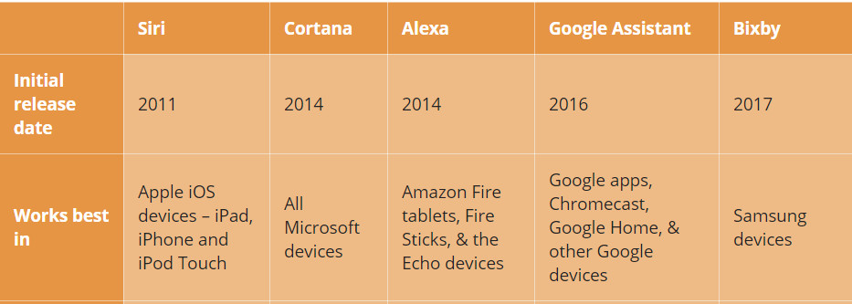

# Gender Recognition by Voice
### Using Logistic Regression and K-Nearest Neighbour

Publish: https://rpubs.com/gabrielerichson/genderbyvoice

#### Intro

Menentukan jenis kelamin seseorang berdasarkan suara mereka merupakan hal yang mudah sebagian besar orang. Namun, **bagaimana jika sebuah mesin dapat mengetahui orang yang sedang berbicara adalah laki-laki atau perempuan?**

Pada kesempatan kali ini, kita akan mencoba melakukan pemodelan statistik untuk mengidentifikasi jenis kelamin seseorang berdasarkan suaranya. Data yang digunakan merupakan hasil analisis akustik oleh [KORY BECKER](http://www.primaryobjects.com/2016/06/22/identifying-the-gender-of-a-voice-using-machine-learning/) yang menggunakan 3.168 sampel rekaman suara dan ucapan dari pria/wanita. Sampel suara pra-diproses menggunakan analisis akustik dalam R menggunakan paket seewave dan tuneR, dengan rentang frekuensi yang dianalisis dari 0 hz-280 hz [(rentang vokal manusia)](https://en.wikipedia.org/wiki/Voice_frequency#Fundamental_frequency). Untuk penjelasan mengenai analisis akustik yang dilakukan dan metode pemodelan lainnya, silahkan menggunjungi situs yang dipublish  [KORY BECKER](http://www.primaryobjects.com/2016/06/22/identifying-the-gender-of-a-voice-using-machine-learning/)

#### Summary

Menentukan jenis kelamin sesorang berdasarkan suara memang terdengar mudah. Namun, akan menjadi berbeda jika sebuah mesin dapat mengetahui jenis kelamin seseorang berdasarkan suaranya. Saat ini terdapat 5 mesin asisten virtual yang umum diketahui, yaitu: 

{width=640px}

 Akan sangat baik apabila sebuah mesin virtual dapat mengetahui gender seseorang untuk menentukan pendekatan, gaya berbicaranya hingga mencari topik yang sedang tren berdasarkan gendernya. Berdasarkan pemodelan dan evaluasi yang sudah dilakukan menunjukan bahwa model Logistic Regression *lebih baik* untuk mengidentifikasi jenis kelamin seseorang berdasarkan suara karena menghasilkan nilai Precision sebesar **97%**, sedangkan model K-Nearest Neighbour hanya menghasilkan nilai Precision sebesar **93%**. Info penting lainnya, jika hendak menerapkan model logistic regression ini maka harus melakukan analisis akustik terlebih dahulu.