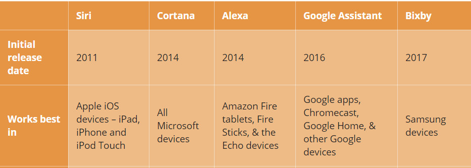

Github: https://github.com/gabrielerichsonmrp/gehm_classification_01

```{r setup, include=FALSE}
knitr::opts_chunk$set(
	echo = TRUE,
	fig.align = "center",
	message = FALSE,
	warning = FALSE,
	comment = "#>",
	result = "hide"
)

options(scipen = 999999999)
rm(list=ls())

library(tidyverse)
library(data.table)
library(paletti)
library(GGally)
library(cmplot)
library(plotly)
library(brglm2)
library(caret)
library(class)
library(ggplot2)

```


# Intro

Menentukan jenis kelamin seseorang berdasarkan suara mereka merupakan hal yang mudah sebagian besar orang. Namun, **bagaimana jika sebuah mesin dapat mengetahui orang yang sedang berbicara adalah laki-laki atau perempuan?**


Pada kesempatan kali ini, kita akan mencoba melakukan pemodelan statistik untuk mengidentifikasi jenis kelamin seseorang berdasarkan suaranya. Data yang digunakan merupakan hasil analisis akustik oleh [KORY BECKER](http://www.primaryobjects.com/2016/06/22/identifying-the-gender-of-a-voice-using-machine-learning/) yang menggunakan 3.168 sampel rekaman suara dan ucapan dari pria/wanita. Sampel suara pra-diproses menggunakan analisis akustik dalam R menggunakan paket seewave dan tuneR, dengan rentang frekuensi yang dianalisis dari 0 hz-280 hz [(rentang vokal manusia)](https://en.wikipedia.org/wiki/Voice_frequency#Fundamental_frequency). Untuk penjelasan mengenai analisis akustik yang dilakukan dan metode pemodelan lainnya, silahkan menggunjungi situs yang dipublish  [KORY BECKER](http://www.primaryobjects.com/2016/06/22/identifying-the-gender-of-a-voice-using-machine-learning/)

<br>

# Read Data

dateset yang digunakan dapat didownload dari [link ini](https://raw.githubusercontent.com/primaryobjects/voice-gender/master/voice.csv) dengan total 3168 obsevasi dan 21 variabel.

```{r}
voice <-  read.csv("data_input/voice.csv")
setnames(voice, "label", "gender")
dim(voice)
```

<br>

# Data Inspection
## 10 top line
```{r}
head(voice,10)
```


## 10 bottom line
```{r}
tail(voice,10)
```


## Variable Description

Data ini dibuat menggunakan Analisis Akustik yang dimana variabel yang dihasilkan sebagai berikut:

 Variabel     |        deksripsi
--------------|---------------------------------------------------------------------------------------------------
duration      | length of signal
meanfreq      | mean frequency (in kHz)
sd            | standard deviation of frequency
median        | median frequency (in kHz)
Q25           | first quantile (in kHz)
Q75           | third quantile (in kHz)
IQR           | interquantile range (in kHz)
skew          | skewness (see note in specprop description)
kurt          | kurtosis (see note in specprop description)
sp.ent        | spectral entropy
sfm           | spectral flatness
mode          | mode frequency
centroid      | frequency centroid (see specprop)
peakf         | peak frequency (frequency with highest energy)
meanfun       | average of fundamental frequency measured across acoustic signal
minfun        | minimum fundamental frequency measured across acoustic signal
maxfun        | maximum fundamental frequency measured across acoustic signal
meandom       | average of dominant frequency measured across acoustic signal
mindom        | minimum of dominant frequency measured across acoustic signal
maxdom        | maximum of dominant frequency measured across acoustic signal
dfrange       | range of dominant frequency measured across acoustic signal
modindx       | modulation index. Calculated as the accumulated absolute difference between adjacent measurements of fundamental frequencies divided by the frequency range
gender        | male or female (**Target Prediksi**)


<br>

# Data Pre-Processing
## Data Structure
Struktur data dibawah menunjukan bahwa tipe data yang dimiliki sudah sesuai dengan kebutuhan pemodelan.
```{r}

glimpse(voice)

```


## Missing Value?

Dataset ini bersih dari missing value.
```{r}
colSums(is.na(voice))
```


## Duplicate Value

Dari 3168 observasi terdapat 3166 observasi yang unik. Terdapat 2 duplikat value, tidak banyak tapi akan lebih baik jika semua data bersifat unik, sehingga data duplikat perlu dibuang untuk mendapat data real.
```{r}
voice_df <- voice
voice <- voice %>% distinct()
data.frame("jumlah.seluruh.data"=nrow(voice_df),
           "jumlah.data.unik" = nrow(distinct(voice_df)),
           "jumlah.data.real"= nrow(voice)
           )

```

<br>

# EDA

Dataset yang dimiliki memiliki proporsi yang seimbang antara data suara laki-laki dan suara perempuan. Hal ini sangat membantu dalam membuat pemodelan. Mari lanjut ke proses Cross Validation.
```{r}
voice %>% group_by(gender) %>% summarise(freq=n()) %>% 
ggplot( aes(x="", y=freq, fill=gender)) + geom_bar(stat="identity", width=1)+
coord_polar("y", start=0) + 
  geom_text(aes(label = paste0(round((freq/sum(freq))*100), "%")), position = position_stack(vjust = 0.5))+
  scale_fill_manual(values=c("pink", "deepskyblue3")) +
  labs(x = NULL, y = NULL, fill = NULL, title = "Data Proportion by Gender")+
  theme_classic() + 
  theme(axis.line = element_blank(),
        axis.text = element_blank(),
        axis.ticks = element_blank(),
        plot.title = element_text(hjust = 0.5),
        axis.title=element_text(size=9,face="bold"), 
        legend.position = "right"
        )

```


***

<br>

# Cross Validation

Dari 3166 data observasi, saya membagi 80% sebagai data train dan 20% sebagai data test. Data train digunakan untuk melakukan pemodelan dan data test digunakan untuk menguji seberapa baik model yang dibuat jika dihadapkan dengan unseen data.
```{r}
set.seed(1000)
idx <- sample(x=nrow(voice),size = nrow(voice)*0.8)
voice_train <- voice[idx,]
voice_test <- voice[-idx,]

data.frame("jumlah.data.train"=nrow(voice_train),
           "jumlah.data.test"=nrow(voice_test))

```


<br>

**Data Proportion**

Target variabel yang akan diprediksi : **gender**. Jika dilihat proporsi data tidak selisih jauh, sehingga bisa langsung dilanjutkan ke proses pemodelan.
```{r}
prop.table(table(voice_train$gender))

```


***

<br>


# Modelling {.tabset .tabset-fade .tabset-pills}

Output yang diharapkan dari projek kali ini yaitu menghasilkan model yang terbaik untuk mengidentifikasi jenis kelamin berdasarkan suara. Dalam proses pembuatan model kali ini, kita akan mencoba menggunakan metode Logistic Regression dan K-Nearest Neighbour, kemudian membandingkan metode mana yang lebih baik?

**Postive Class of Target Variable**<br>
Dalam melakukan pemodelan regresi logistik, salah satu hal penting yang perlu diketahui sebelum membuat model klasifikasi ini adalah positive class dari target yang akan kita prediksi. Hal ini bisa diketahui berdasarkan posisi paling terakhir dari level variabel target. Berdasarkan dataset yang kita miliki, Positive Class dari variabel target yaitu **male**

```{r}
levels(voice$gender)
```


## Logistic Regression


### Model Fitting: Logistic Regression
Sama seperti regresi linear, feature selection atau pemilihan variabel prediktor untuk pemodelan regresi logistik bisa berdasarkan business wise atau dapat menggunakan pendekatan stepwise. Pada pemodelan ini, saya putuskan menggunakan pendekatan **step-wise : backward**.

```{r}
voice_glm <- glm(gender~.,data = voice_train, family = "binomial")

model_backward <- step(
  voice_glm,
  direction = "backward"
)
```


Berdasarkan proses Backward step-wise diatas, formula dengan nilai AIC paling kecil adalah formula yang paling optimal. Sehingga variabel yang digunakan untuk memprediksi **gender** berdasarkan suara pada pemodelan regresi logistik ini yaitu **Q25**, **Q75**, **kurt**, **sp.ent**, **sfm**, **meanfun**, **minfun** dan **modindx**

```{r}
# Fitted Model
voice_glm_model <- glm(
                        formula = gender ~ Q25 + Q75 + kurt + sp.ent + sfm +meanfun + minfun + modindx, 
                        data = voice_train,
                        family = "binomial"
                       )

summary(voice_glm_model)

```

Pada hasil summary model regresi logistik diatas, nilai pada kolom Estimate menunjukan koefiesiennya. Dari nilai koefisien ini bisa diketahui pengaruh dari variabel tersebut bersifat postif atau negatif terhadap positive class. Beirkut lebih jelasnya:

```{r}
data.frame("coef" = coef(voice_glm_model),
           "Odds_ratio" = exp(coef(voice_glm_model)))
```

Data diatas merupakan nilai dari koefisien dan Odds Ratio dari setiap variabel yang kita gunakan sebagai prediktor pada model ini. Jika dilihat variabel yang memiliki pengaruh positif terhadap positive class yaitu **Q75**, **sp.ent** dan **minfun** dan variabel yang berpengaruh negatif terhdap positive class yaitu **Q25**, **kurt**, **sfm**, **meanfun** dan **modindx**. Hal yang unik disini, variabel yang berpengaruh positif memiliki andil yang sangat besar dalam menentukan gender. Misalnya, setiap kenaikan 1 satuan nilai Q75 maka peluang suara tersebut merupakan suara laki-laki sebesar 2696235877273962377442830000% . **Wow, seriusan nih?** mari kita cek apakah terdapat *Perfect Separator* pada model kita?


### Perfect Seperator

Perfect Seperator adalah kejadian dimana terdapat variabel yang memiliki nilai koefisien sangat besar. Apabila terdapat kejadian seperti ini, nilai dari variabel tersebut akan menjadi sangat dominan dan mampu memisahkan variabel targetnya dengan pasti.

```{r}

glm(
    formula = gender ~ Q25 + Q75 + kurt + sp.ent + sfm +meanfun + minfun + modindx, 
    data = voice_train,
    family = "binomial",
    method = "detect_separation"
   )

```

Jika dilihat dari hasil diatas, model yang kita buat tidak memiliki Perfect Seperator. Dapat dilihat, nilai 0 menandakan variabel terkait memiliki porsi nilai yang terbatas dalam menentukan target prediksi. Dengan begitu, model ini dapat dilanjutkan ke proses prediksi.


### Predict

Berikut hasil prediksi menggunakan model `voice_glm_model` ke data test `voice_test` menggunakan threshold `0.5`. Variabel **gender** merupakan data test, **predict_probability** merupakan nilai peluang terhadap kelas positif dan **predict_gender** merupakan hasil prediksi gender.

*hint*: Jika peluang > 0.5 maka **male**.

```{r}
voice_predict <- voice_test %>% 
  mutate(
    predict_probability = predict(object = voice_glm_model, newdata=voice_test, type = "response"),
    predict_gender= case_when(
                              predict_probability>0.5~"male",
                              predict_probability<=0.5~"female"
                            ),
    predict_gender = factor(predict_gender,levels = c("female","male")),
    
  )


voice_predict[,
              c("gender","predict_probability","predict_gender",
                "meanfreq","sd","median","Q25","Q75","IQR","skew","kurt", 
                "sp.ent", "sfm", "mode", "centroid", "meanfun",
                "minfun","maxfun", "meandom","mindom","maxdom","dfrange","modindx")
              ]
           
```


***

<br>


## K-Nearest Neighbour

### Split Target - Predictor

Sebelumnya kita sudah membuat data Train dan data Test. Namun, dalam melakukan pemodelan K-Nearest Neighbour perlu dilakukan pemisahan data variabel Target dan variabel Predictor baik pada data Train maupun data Test. Berikut prosesnya:

```{r}
voice_train_x <- voice_train %>% select(-gender)
voice_test_x <- voice_test %>% select(-gender)

voice_train_y <- voice_train %>% select(gender)
voice_test_y <- voice_test %>% select(gender)


```


### Feature Scalling

Proses prediksi KNN berdasarkan jarak sesuai nilai dari variabel yang digunakan, sehinnga perlu dilakukan scalling atas semua variabel predictor-nya untuk memperkecil kemungkinan error yang terjadi. Dalam case ini, setiap variabel memiliki range yang tidak sama dan tidak memiliki range nilai yang pasti sehinga saya memutuskan menggunakan **Z-score Standarization**. 

```{r}
voice_train_x <- scale(voice_train_x)

voice_test_x <- scale(voice_test_x,
                     center = attr(voice_train_x, "scaled:center"),
                     scale = attr(voice_train_x,"scaled:scale")
                     )

```


### Model Fitting : KNN

Proses pemodelan menggunakan KNN tidak perlu melakukan pemilihan variabel prediktor seperti pemodelan regresi logistik. Jika hendak melakukan pemilihan variabel, maka bisa dilakukan proses PCA sebelum masuk ke tahap split train-test. Berikut pemodelan dan prediksi menggunakan KNN:

```{r}
k_value <- round(sqrt(nrow(voice_train)),0)
k_value

knn_predict <-  class::knn(
    train = voice_train_x,
    test = voice_test_x, 
    cl = voice_train_y$gender,
    k=50,
    prob = TRUE
  )

```

Pada script prediksi KNN diatas terdapat beberapa variabel sebagai berikut: 

**train** : Objek prediktor (variabel x) di data train. <br>
**test** : Objek prediktor (variabel x) di data test. <br>
**cl** : label untuk data train k: integer untuk menentukan berapa banyak k tetangga. Menggunakan. <br> 
**k** : dari hasil *sqrt(jumlah observasi dari data train)*. Dalam case ini *sqrt(2532)*. <br><br>


### Predict 

Pada R, proses pemodelan hingga prediksi langsung menggunakan fungsi `knn` dan sudah dilakukan pada proses diatas. Berikut hasil prediksinya:

**Hasil Prediksi KNN:**
```{r, foldcode=TRUE}
voice_predict_knn <- cbind(voice_test, predict_probability=attr(knn_predict,"prob"), predict_gender= knn_predict)
voice_predict_knn[,
              c("gender","predict_probability","predict_gender",
                "meanfreq","sd","median","Q25","Q75","IQR","skew","kurt", 
                "sp.ent", "sfm", "mode", "centroid", "meanfun",
                "minfun","maxfun", "meandom","mindom","maxdom","dfrange","modindx")
              ]
```


***

<br>


# Model Evaluation

## Data Test VS Prediction
```{r, fig.asp=0.8}
predict_proportion <- voice_test %>% 
  select(gender) %>% 
  mutate(
    glm_probability = voice_predict$predict_probability,
    glm_gender = voice_predict$predict_gender,
    knn_probability = attr(knn_predict,"prob"),
    knn_gender = knn_predict
  )

plot_predict_proportion <- gather(data=predict_proportion, 
                                  key=type, 
                                  value=gender, gender,glm_gender, knn_gender, 
                                  factor_key=T)

plot_predict_proportion %>% 
  group_by(type,gender) %>% 
  summarise(freq=n()) %>% 
  ggplot(aes(x=gender,y=freq,fill=type),group=type,color = type)+
  geom_col(position = "dodge")+
  geom_text(aes(label=freq, y=freq+5), vjust = -0.5, size=4, position = position_dodge(width = 0.9)) +
  labs(
    title = "Gender Proportion by Prediction",
    subtitle = "Gender Proportion of Data Test VS Logistic Regression VS KNN",
    x="Gender",
    y="Total",
    fill = ""
  )+
  theme_minimal()+
  theme(
      axis.title=element_text(size=9,face="bold"), 
      axis.text.x=element_text(size=10,margin = margin(b=10)),
      axis.text.y.left = element_text(margin = margin(l=10)),
      legend.position = "bottom",
      legend.margin=margin(t = 0,l=0,r=0, unit='pt')
  ) +
  scale_fill_manual(labels = c("Data Test", "GLM Predict", "KNN Predict"),
                    values = alpha(c("dodgerblue3", "goldenrod2","forestgreen"), .8))


```


Jika dilihat dari selisih proporsi antara data gender di data test dan data gender di data hasil prediksi cenderung kecil. Namun, **secara proporsi datanya**, metode Logistic Regression **lebih baik** daripada metode K-Nearest Neighbour karena selisih jumlah data prediksi terhadap data test sangat kecil. *Tapi meskipun begitu, chart tersebut tidak dapat merepresentasikan ketepatan hasil prediksi. Mari kita evaluasi menggunakan Confussion Matrix*.


## Confusion Matrix

Untuk mengevaluasi model Logistic Regression dan K-Nearest Neighbour dapat menggunakan **Confusion Matrix**.  Pada Confusion Matrix terdapat beberapa value yang digunakan untuk mengevaluasi, yaitu:

1. `Accuracy` : seberapa mampu model saya menebak dengan benar target Y.<br>
2. `Re-call/Sensitivity` : dari semua data aktual yang positif, seberapa mampu proporsi model saya menebak benar.<br>
3. `Specificity` : dari semua data aktual yang negatif, seberapa mampu proporsi model saya menebak yang benar.<br>
4. `Precision/Pos Pred Value` : dari semua hasil prediksi, seberapa mampu model dapat menebak tepat kelas positif.
<br>

Pada pemodelan ini, saya lebih mengutamakan nilai **Precision/Pos Pred Value** karena saya ingin model ini benar-benar tepat menebak jenis kelamin seseorang. Berikut hasil evaluasinya:

### Logistic Regression

```{r}
# Confusion Matrix : Logistic Regression
caret::confusionMatrix(data = as.factor(voice_predict$predict_gender),
                reference = as.factor(voice_predict$gender),
                positive = "male")
```

Berdasarkan hasil evaluasi Confussion Matrix diatas, model Logistic Regression yang mendapat nilai Accuracy sebesar 97%, Sensitivity sebesar 98% dan Specificity sebesar 97% dan Precision sebesar **97%**. Dengan kata lain, model ini juga sudah sangat baik. Dengan kata lain, model ini sangat baik untuk mengindentifikasi jenis kelamin seseorang berdasarkan suaranya.

<br>

### K-Nearest Neighbour

```{r}
# Confusion Matrix: K-Nearest Neighbour
confusionMatrix(data = as.factor(voice_predict_knn$predict_gender), 
                reference = as.factor(voice_predict_knn$gender), 
                positive = "male")
```


Berdasarkan hasil evaluasi Confussion Matrix diatas, model K-Nearest Neighbour yang sudah dibuat mendapat nilai Accuracy sebesar 95%, Sensitivity sebesar 98% dan Specificity sebesar 92% dan Precision sebesar **93%**. Dengan kata lain, model ini juga sudah sangat baik. Namun, karena nilai Precision pada metode Logistic Regression lebih tinggi dari pada K-Nearest Neighbour maka model Logistic Regression yang sudah dibuat lebih baik untuk mengidentifikasi jenis kelamin berdasarkan suaranya.


***

<br>

# Summary

Menentukan jenis kelamin sesorang berdasarkan suara memang terdengar mudah. Namun, akan menjadi berbeda jika sebuah mesin dapat mengetahui jenis kelamin seseorang berdasarkan suaranya. Saat ini terdapat 5 mesin asisten virtual yang umum diketahui, yaitu:<br>
<center>
{width=640px}
</center>
<br>Akan sangat baik apabila sebuah mesin virtual dapat mengetahui gender seseorang untuk menentukan pendekatan, gaya berbicaranya hingga mencari topik yang sedang tren berdasarkan gendernya. Berdasarkan pemodelan dan evaluasi yang sudah dilakukan menunjukan bahwa model Logistic Regression *lebih baik* untuk mengidentifikasi jenis kelamin seseorang berdasarkan suara karena menghasilkan nilai Precision sebesar **97%**, sedangkan model K-Nearest Neighbour hanya menghasilkan nilai Precision sebesar **93%**. Info penting lainnya, jika hendak menerapkan model logistic regression ini maka harus melakukan analisis akustik terlebih dahulu.


***

<br>

# Reference

1. [Prediksi Pasien Penyakit Jantung](https://rpubs.com/inayatus/klasifikasi)
2. [User Score Classification With Sentiment Analysis: Logistic Regression and K-NN](https://rpubs.com/Argaadya/529538)
3. [Siri vs Cortana vs Alexa vs Google Assistant vs Bixby](https://reachbyte.com/siri-cortana-alexa-google-assistant-bixby/)
4. [Identifying the Gender of a Voice using Machine Learning](http://www.primaryobjects.com/2016/06/22/identifying-the-gender-of-a-voice-using-machine-learning/)
5. [Voice frequency](https://en.wikipedia.org/wiki/Voice_frequency#Fundamental_frequency)

